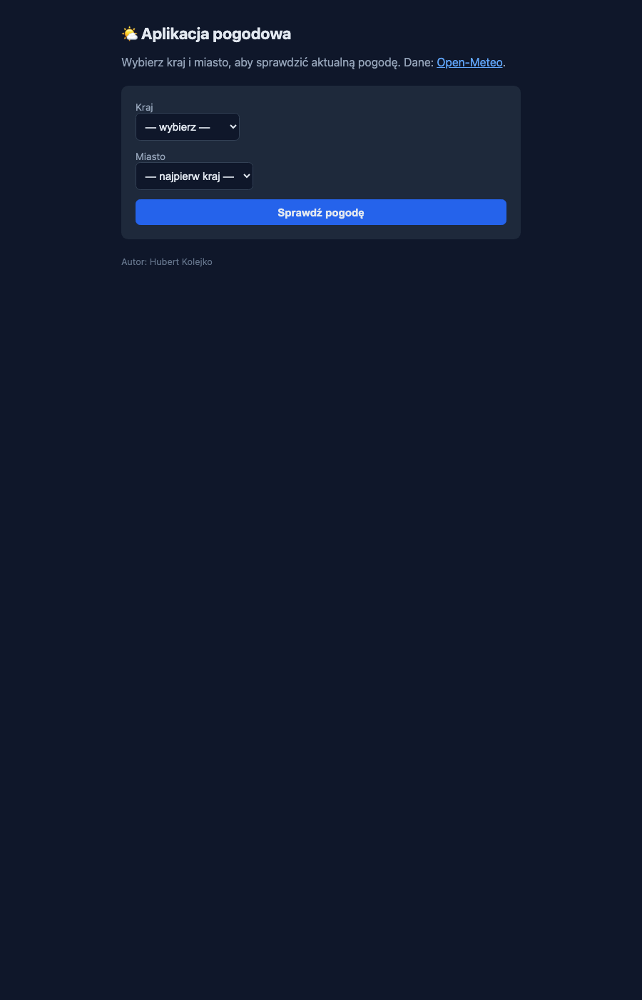
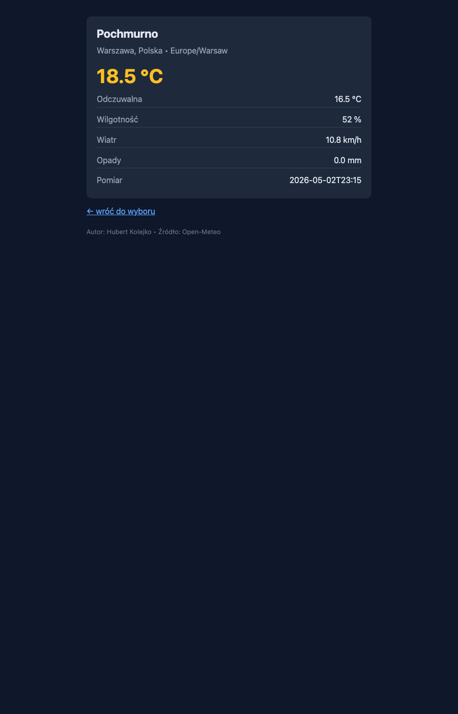

# Zadanie 1 — część obowiązkowa

**Laboratorium:** Programowanie Aplikacji w Chmurze Obliczeniowej
**Autor:** Hubert Kolejko
**Repozytorium GitHub:** <https://github.com/GhostekTheGuy/zad1_lab_docker>
**Repozytorium DockerHub:** <https://hub.docker.com/r/hubertkolejko/zad1-weather>

---

## 1. Aplikacja (max. 30%)

### Założenia projektowe

- **Język**: Go (tylko biblioteka standardowa — żadnych zewnętrznych zależności).
- **Powód wyboru**: statycznie linkowana binarka Go (`CGO_ENABLED=0`) działa bez glibc/musl, dzięki czemu obraz finalny może być oparty o `scratch` — co bezpośrednio przekłada się na konkurencyjny rozmiar obrazu (cel konkursu: minimalny rozmiar).
- **Źródło danych pogodowych**: [Open-Meteo](https://open-meteo.com) — darmowe, bez klucza API, JSON, HTTPS.
- **Lista lokalizacji**: predefiniowana, zaszyta w binarce (mapa `kod kraju → lista miast`).

### Funkcjonalność (zgodnie z punktami 1a i 1b)

**1a — logi startowe.** Po starcie kontenera aplikacja wypisuje datę uruchomienia w formacie RFC3339, imię i nazwisko autora oraz port TCP nasłuchu:

```
== Zadanie 1 — start aplikacji ==
Data uruchomienia : 2026-05-02T20:49:38Z
Autor             : Hubert Kolejko
Port TCP (nasłuch): 8080
Serwer gotowy: http://0.0.0.0:8080/
```

**1b — UI z wyborem kraju/miasta.** Aplikacja wystawia trzy endpointy HTTP:

| Endpoint | Cel |
|---|---|
| `GET /` | Formularz HTML z dwoma `<select>` (kraj → miasto). Lista miast aktualizuje się dynamicznie po wyborze kraju (mały fragment JS inline, dane z embedded JSON). |
| `GET /weather?country=PL&city=Warszawa` | Pobiera bieżącą pogodę z Open-Meteo (temperatura, odczuwalna, wilgotność, wiatr, opady, opis WMO) i renderuje wynik. |
| `GET /health` | Endpoint healthcheck — zwraca `200 OK`/`ok`. |

Aplikacja obsługuje też flagę `-healthcheck` — wtedy binarka wykonuje wewnętrzny GET na `/health` i kończy się kodem 0 lub 1. Jest to konieczne, bo obraz `scratch` nie zawiera `curl`/`wget`/`sh`, więc klasyczny `HEALTHCHECK CMD curl ...` nie zadziała — rozwiązanie z self-healthcheckiem jest standardowym wzorcem dla obrazów scratch.

Predefiniowana lista lokalizacji (7 krajów, 18 miast) — patrz [`cmd/server/main.go`](cmd/server/main.go) (zmienna `countries`).

### Pełny kod źródłowy

Kod znajduje się w pliku [`cmd/server/main.go`](cmd/server/main.go) wraz z komentarzami. Najważniejsze decyzje projektowe:

- **Brak zewnętrznych zależności** — `go.mod` nie ma `require`. Wszystko opiera się o `net/http`, `html/template`, `encoding/json`, `flag`, `log`, `time`, `os`, `context`, `net`. Mniejsza powierzchnia ataku CVE i mniejsza binarka.
- **Szablony HTML** zaszyte jako string literals w binarce (`indexTmpl`, `weatherTmpl`) — brak zewnętrznych assetów, brak `COPY templates/` w obrazie.
- **Pre-bind portu** (`net.Listen` przed `srv.Serve(ln)`) — błąd portu pokazuje się od razu w logach startowych, a nie dopiero przy pierwszym żądaniu.
- **Mapowanie WMO Weather Codes** na opisy PL — pełna lista kodów z dokumentacji Open-Meteo.

---

## 2. Dockerfile (max. 50%)

Plik: [`Dockerfile`](Dockerfile)

### Zastosowane techniki optymalizacji

| Technika | Efekt |
|---|---|
| **Multi-stage build** (2 etapy: `builder` → `scratch`) | Toolchain Go i dependencje pozostają w stage'u `builder`; etap finalny dostaje tylko binarkę i CA certs. |
| **`FROM scratch`** | Brak systemu plików, brak shella, brak `apk`/`apt` — minimum rozmiaru i najmniejsza powierzchnia ataku. |
| **`CGO_ENABLED=0`** + `-trimpath` + `-ldflags="-s -w"` | Binarka statyczna, bez symboli debugowych i ścieżek lokalnych — mniejsza i deterministyczna. |
| **Cache mounts BuildKit** (`--mount=type=cache`) dla `/go/pkg/mod` i `/root/.cache/go-build` | Cache modułów i kompilacji jest przechowywany w buildkicie, nie w warstwach obrazu — szybkie rebuildy bez powiększania finalnego obrazu. |
| **Osobne `COPY go.mod`** przed `COPY cmd` | Warstwa zależności jest cache'owana niezależnie od zmian w kodzie aplikacji. |
| **`--platform=$BUILDPLATFORM`** + `ARG TARGETOS/TARGETARCH` | Cross-compile w stage'u builder pozwala efektywnie budować obrazy multi-arch (wykorzystywane w części dodatkowej). |
| **`USER 65534:65534`** (nobody) | Zasada najmniejszych uprawnień — proces nie biega jako root. |
| **`HEALTHCHECK` z self-checkiem binarki** | W `scratch` nie ma `curl`/`wget`, więc binarka sama wykonuje wewnętrzny GET na `/health`. |
| **OCI labels** | Zgodność z [OCI Image Spec — annotations](https://specs.opencontainers.org/image-spec/annotations/), w tym `org.opencontainers.image.authors="Hubert Kolejko"` (wymagane przez treść zadania). |
| **Połączone `COPY` w runtime do dwóch poleceń** | Tylko 2 fizyczne warstwy w obrazie finalnym (CA + binarka). |

### Etykiety OCI (autor)

```dockerfile
LABEL org.opencontainers.image.title="zad1-weather"
LABEL org.opencontainers.image.description="Aplikacja pogodowa — Zadanie 1, lab Programowanie Aplikacji w Chmurze Obliczeniowej"
LABEL org.opencontainers.image.authors="Hubert Kolejko"
LABEL org.opencontainers.image.source="https://github.com/GhostekTheGuy/zad1_lab_docker"
LABEL org.opencontainers.image.licenses="MIT"
LABEL org.opencontainers.image.version="1.0.0"
```

### Healthcheck

```dockerfile
HEALTHCHECK --interval=30s --timeout=3s --start-period=5s --retries=3 \
    CMD ["/server", "-healthcheck"]
```

Po `--start-period=5s` Docker sprawdza zdrowie kontenera co 30s. Gdy 3 kolejne sprawdzenia zawiodą, kontener jest oznaczony jako `unhealthy`. Polecenie wykonuje samą binarkę z flagą `-healthcheck`, która robi wewnętrzne `GET /health` z timeoutem 2s i kończy się kodem `0`/`1`.

---

## 3. Polecenia budowania, uruchamiania i diagnostyki (max. 20%)

### a) Zbudowanie obrazu

```bash
docker build -t hubertkolejko/zad1-weather:latest .
```

### b) Uruchomienie kontenera

```bash
docker run -d --name zad1 -p 8080:8080 hubertkolejko/zad1-weather:latest
```

Otwórz <http://localhost:8080> w przeglądarce.

### c) Logi z punktu 1a

```bash
docker logs zad1
```

Faktyczny wynik (sesja testowa):

```
== Zadanie 1 — start aplikacji ==
Data uruchomienia : 2026-05-02T21:14:58Z
Autor             : Hubert Kolejko
Port TCP (nasłuch): 8080
Serwer gotowy: http://0.0.0.0:8080/
```

### d) Liczba warstw i rozmiar obrazu

**Liczba warstw** (RootFS — fizyczne warstwy plików):

```bash
docker image inspect hubertkolejko/zad1-weather:latest --format '{{len .RootFS.Layers}}'
# 2
```

**Pełna historia** (dla pełnego kontekstu — zawiera też metadane LABEL/EXPOSE/itp., które nie tworzą fizycznych warstw):

```bash
docker history hubertkolejko/zad1-weather:latest
```

Wynik:

```
CREATED BY                                      SIZE
ENTRYPOINT ["/server"]                          0B
HEALTHCHECK &{["CMD" "/server" "-healthche…     0B
EXPOSE map[8080/tcp:{}]                         0B
USER 65534:65534                                0B
LABEL org.opencontainers.image.version=1.0.0    0B
LABEL org.opencontainers.image.licenses=MIT     0B
LABEL org.opencontainers.image.source=https…    0B
LABEL org.opencontainers.image.authors=Hubert…  0B
LABEL org.opencontainers.image.description=A…   0B
LABEL org.opencontainers.image.title=zad1-we…   0B
COPY /out/server /server # buildkit             8.40MB
COPY /etc/ssl/certs/ca-certificates.crt /etc…   238kB
```

**Rozmiar obrazu**:

```bash
docker images hubertkolejko/zad1-weather:latest
```

```
IMAGE                               ID            DISK USAGE   CONTENT SIZE
hubertkolejko/zad1-weather:latest   663600a234a2       12.1MB         3.49MB
```

| Metryka | Wartość |
|---|---|
| Liczba fizycznych warstw | **2** (binarka + CA certs) |
| Rozmiar skompresowany (CONTENT SIZE) | **3.49 MB** |
| Rozmiar po rozpakowaniu (DISK USAGE) | **12.1 MB** |
| Rozmiar binarki Go | 8.40 MB |
| Rozmiar CA certs | 238 kB |
| Wersja Go (toolchain) | 1.26 (alpine) — wybrana, by wyeliminować wszystkie CVE z stdlib starszych Go |

---

## Zrzuty ekranu

- Formularz wyboru kraju/miasta (strona główna `/`):



- Wynik zapytania o pogodę (`/weather?country=PL&city=Warszawa`):



---

## Linki

- **GitHub**: <https://github.com/GhostekTheGuy/zad1_lab_docker>
- **DockerHub**: <https://hub.docker.com/r/hubertkolejko/zad1-weather>
  - tag `latest` / `1.0.0` — wersja obowiązkowa (single-arch)
  - tag `multiarch` / `1.0.0-dod` — wersja z części dodatkowej (multi-arch, patrz [`zadanie1_dod.md`](zadanie1_dod.md))
  - tag `buildcache` — registry cache (część dodatkowa)
